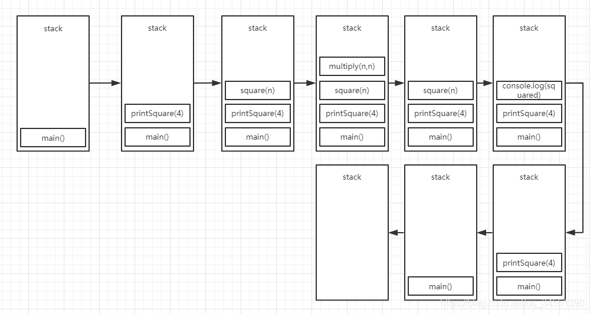
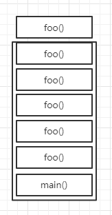
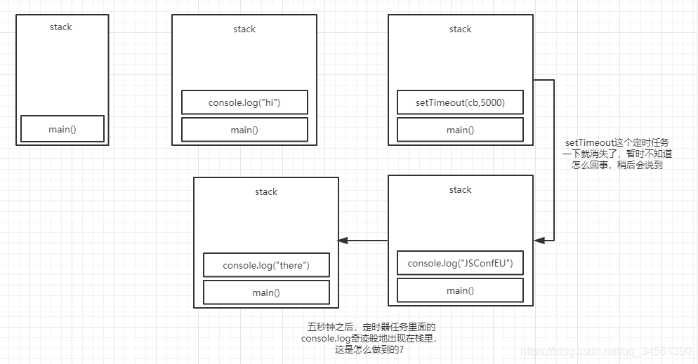
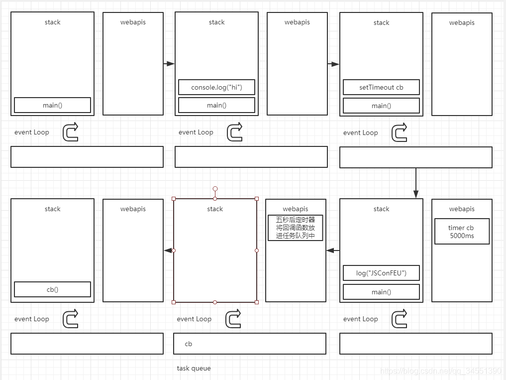
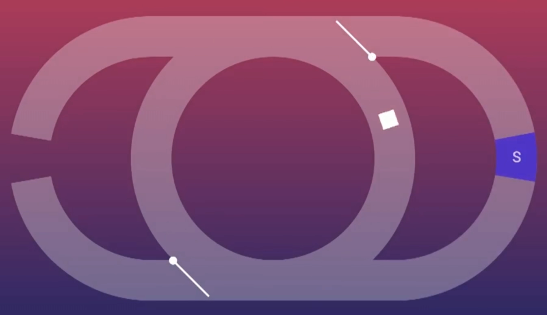
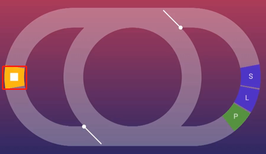
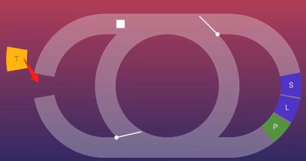
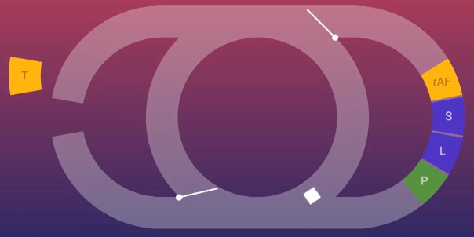
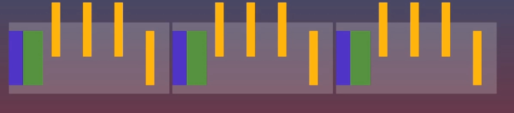
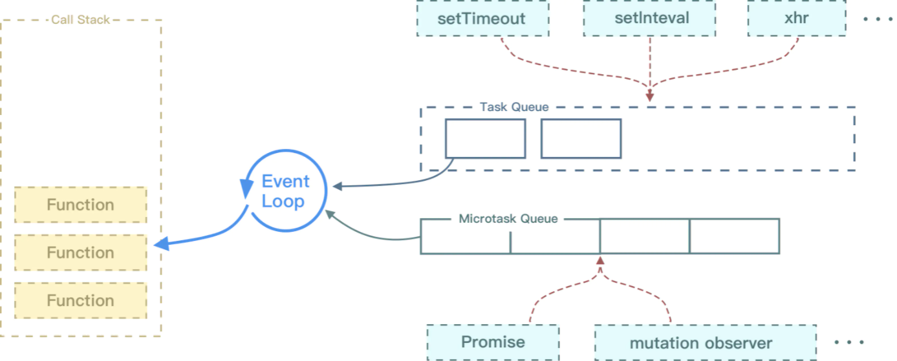

# 事件循环/宏任务/微任务

## 一、事件循环

在这里我们详细地讲讲事件循环里面的调用栈和任务队列，先看看下面这段代码
```
function multiply(a, b){
    return a * b;
}
function square(n) {
    return multiply(n, n);
}
function printSquare(n) {
    var squared = square(n);
    console.log(squared);
}
printSquare(4);
```
调用栈是一个数据结构，用于记录我们当前处在程序运行的哪个位置，如果调用了函数，就让它进栈，如果栈顶函数返回结果，就让它出栈，这个栈就是做函数的压入和弹出。我们运行这段代码，那么整段代码相当于一个main函数，所以我们把它压入栈中，下图就是整段代码的入栈出栈过程



如果你听说过栈溢出的话，这里有个例子
```
function foo() {
    return foo();
}
foo();
```
这摆明了就是一个套娃嘛



最后浏览器会问你，你该不会帧的要递归调用16000次foo吧？“Maximum call stack size excceeded”,我会先帮你终止进程，让你去检查代码。

我们先谈谈阻塞和阻塞的行为，实际上关于非阻塞并没有一个准确的定义，它只是一段执行速度很慢的代码。比如console.log就很快，但是做十亿次就很慢，图片请求很慢，网络请求也很慢，所以，阻塞其实指的就是栈中运行很慢的那些东西，比如这里有一段执行同步任务的伪代码。假设这里是jquery发起ajax请求，如果这是同步的会怎么样呢？让我们先忘记异步回调，假设这里是同步的
```
var foo = $.getSync("//foo.com");
var bar = $.getSync("//bar.com");
var qux = $.getSync("//qux.com");

console.log(foo);
console.log(bar);
console.log(qux);
```
在单线程编程语言中，我们无法像Ruby那样使用多线程，也就是说，在发出请求之后，必须一直等待，直到返回结果，除此之外并没有合适的处理方式，那么，问题何在呢？

我们用一个while循环来模拟上面这个过程，这里的while循环大概会持续一秒甚至五秒之后才能继续，在代码执行的过程中，页面的按钮，链接等等，点击都是无效的，被卡住了，除非请求完成，这个很明显不是我们想要的。如果我们想要给用户更好的体验，就不应该阻塞调用栈，那怎么处理这个问题呢？最简单的方法就是异步回调，使用异步回调之后，在浏览器或者node中几乎没有任何阻塞函数，它们都成了异步函数，我们运行代码，给它一个回调，稍后再回过头来执行。
```
console.log('hi');
setTimeout(function() {
    console.log('there);
}, 5000);
console.log('JSCONFEU');
```
那么将异步回调和此前聊过的调用栈联系起来，上面这段代码具体是怎么运行的呢？





代码运行执行console.log打印hi，接着我们看一下setTimeout的时候发生了什么？我们传递了一个回调函数参数和一个时间函数。注意setTimeout是浏览器提供给我们的api（运行JavaScript的环境提供给我们的），调用之后，浏览器给我们设置了一个定时器，之后浏览器会在一遍进行计时。setTimeout调用后已经成功设置了定时器，所以此时它可以出栈了，然后打印JSConfEU，调用栈清空。那么现在Webapi中就有一个定时器，计时五秒后结束，而Webapi是不能无缘无故改动你的代码的，它不能冒然进入调用栈中，否则就会像是随机出现在你的代码中一样。因此这里引入了任务队列或者回调任务队列。一般在Webapi结束之后（计时结束、请求得到响应等）会把回调函数送到任务队列中。然后，我们的重点--事件循环，终于出现了。事件循环实际上就像是这一整个过程中最简单的那个部分。事件循环做的事情很简单，就是查看栈和任务队列，如果栈空，那么就把任务队列队头的任务压入栈中，之后这个任务得到执行。

现在可以看到，console.log('JSCONFEU');执行完之后栈是空的，任务队列中还有一个回调函数。线程说：“我得做点什么了”，于是它把回调函数压入栈中，调用栈是Javascript管辖的地盘，所以接下来就是v8的工作了。所以，回调函数进入栈中并执行，打印there！！！

接下来我们来看一个不一样的案例，这很可能是你初学异步时感到困惑的地方，把上面的定时器5000改为0，既然如此，我何必要像之前那样把回调函数放在setTimeout里面呢？直接执行不香吗？其实这么做的目的是，让回调在调用栈清空后再来执行，改为0之后，运行输出的代码还是一样的。因为执行到定时器的时候，马上计时完成并被送到队列中。因为事件循环必须等到栈清空之后，才能讲任务队列中的任务压入栈中。

接下来我们看这段代码
```
// # 1
console.log('started);
// # 2
$.on('button','click',function onClick(){
    // # 3
    console.log('Clicked');
});
// # 4
setTimeout(function onTimeout(){
    // # 5
    console.log('Timeout');
},5000);
// # 6
console.log('Done);
```
图我就先不画了，太累人。这段代码会先把1放入执行栈，执行完后把2放入调用栈，发现2是个webapi，所以放到webapi的框框里面，接着把4放入执行栈，发现4也是一个webapi，所以放入webapi的框框里面，接着把6放入执行栈，5秒钟到了之后，把5放入任务队列，然后发现执行栈空了，把5放入执行栈执行，接着发现用户触发点击事件，把3放入任务队列，同样也是发现执行栈空了，所以把3放入执行栈执行，至此所有流程执行完毕。

接着再来看一段代码，这段代码可以看出些许同步程序和异步程序的运行时间差别
```
// 同步调用
// # 1
[1,2,3,4].forEach(function(i){
    // # 2
    console.log(i);
})
// 异步调用
// # 3
function asyncForEach(array,cb){
    // # 4 
    array.forEach(function(){
        // # 5
        setTimeout(cb,0);
    })
}
// # 6
asyncForEach([1,2,3,4],function(i){
    // # 7
    console.log(i)
})
```
首先把1放入执行栈，然后四个2陆续放入执行栈，执行完之后，6放入执行栈，4放入执行栈，然后陆续四个5放入执行栈，发现是webapi，就放入webapi的框框里，然后再陆续把四个回调7放进任务队列，最后陆陆续续放进执行栈。这个例子其实异步化的有点并不是很明显，因为都是毫秒级别的程序，但是假设，数组里面是一个很耗时的操作，异步化的有点就显而易见了。

浏览器每16.6毫秒会针对页面进行一次重绘，这种尽可能的重绘使得页面保持在每秒60帧，但是重绘过程是收到JavaScript影响的，在执行栈未清空的时候，是无法进行重绘的。和前面说到的一样，webapi的回调需要等到执行栈为空的时候才能执行，不同的是，渲染的优先级高于之前所说的回调。一般来说，每16ms它就会进入一次队列，并等到栈清空后真正进行渲染。每16.6毫秒都在询问是否可以渲染，由于栈是空的，所以都得到了肯定的答复，但是上面的代码如果变成下面这样
```
// 同步调用
// # 1
[1,2,3,4].forEach(function(i){
    // # 2
    delay();
})
// 异步调用
// # 3
function asyncForEach(array,cb){
    // # 4 
    array.forEach(function(){
        // # 5
        setTimeout(cb,0);
    })
}
// # 6
asyncForEach([1,2,3,4],function(i){
    // # 7
    delay();
})
```
delay()是一个非常耗时的同步任务，那么在同步调用里面，这个费时的操作将阻塞渲染过程，一旦被阻塞渲染，就意味着我们不能选中文本，不能进行点击，不能得到响应。在异步的代码里面，虽然在执行的时候也有些许阻塞，但是相比于同步的代码，已经快了很多了。在一个回调出栈，另一个回调进栈的间隙（此时栈为空），渲染得以顺利进行。

## 二、事件循环和页面渲染
```
document.body.appendChild(el)
el.style.display = 'none'
```
这段代码的意思是向DOM添加节点并且把这个节点隐藏起来，大概是为了后面点击按钮再显示出来。但是我一开始会很紧张，能确定嘛？用户在隐藏之前不会看到这个元素闪一下嘛？虽然重来没有看到过会出现这种情况，但是你不知道什么时候会碰上竞争条件。所以我总会把这两行代码调换一下位置，这样我夜里就能睡着了。
```
el.style.display = 'none'
document.body.appendChild(el)
```
但实际上，这里并没有竞争条件，因为js的执行和页面的渲染都有规定的时间段，这都要归功于事件循环。
网页我们有一个称之为主线程的东西，之所以称之为主线程是因为这里发生的大量的事情，是js发生的地方，这里是渲染发生的地方，这里是DOM存在的地方，这意味着网页上大部分的活动都具有确定性的顺序，我们不会同时运行多段代码去修改同一处DOM，让你处于一个可怕的竞争世界，但它意味着如果主线程上的任务需要很长的时间，用户会注意到，它阻塞了加载渲染和交互。
```
setTimeout(function(){
  // 修改界面
}，5000)
```
我们来假设浏览器的运行机制是，主线程上面运行这段代码的时候，主线程等待五秒钟，然后阻塞了主线程上的其他活动，这个明显很不合理。再提出一种假设，我们把等待五秒钟和执行回调函数改成两个同时运行的步骤，换句话说就是离开这线程，同时运行这个任务，但是现在有了一个新的问题，因为现在我们在主线程以外触发这个回调函数，这行不通，因为最终会有大量并行运行的js，编辑相同的DOM，你最终会面临竞争条件。所以我们要做的就是，创建一个任务加到任务队列，以便在某个时刻回到主线程继续执行。现在我们在js所在的线程上调用js，所以这种方案行得通。这是浏览器的核心原理。当你单击鼠标，操作系统如何通知js呢？通过向任务队列里加入任务。请求响应数据如何进入到js中呢？通过向任务队列里加入任务。当你从以页面发送消息到webworker时，同样通过向任务队列中加入任务。

任务环中首先关注任务队列（Task Queue），这也是任务环中历史最悠久的部分


webapi是浏览器提供给我们的一些api，还有一个神秘的事件循环（Event Loop）和一个回调任务队列（Task Queue）
JavaScript是一门单线程的语言，单线程在运行时，意味着它只有一个调用栈，也就是上图的stack，同一时刻只能做一件事，我们先来看一个简单的案例，可以用可视化的方式理解一下这部分的知识



左边代表Task Queue，右边代表渲染任务
如果我们这时候写了一个无限循环，比如
```
while(true){}
```
那么循环移动到这就会被卡在这里，界面的gif会动不了，文字选不中



现在我们回过头看一下上面那段display的代码，我们总担心内容会闪现，其实并不会，因为脚本作为任务的一部分，必须执行结束，浏览器才会执行渲染，事件环可以确保你的任务在下一次渲染之前完成。我们再来看一个循环
```
function loop() {
  setTimeout(loop, 0);
}
loop();
```
这也是一个循环，在setTimeout的回调中调用自身，我们发现这段代码并不会阻塞页面渲染什么的，那如果按照上面的环图来解释要怎么解释呢？



白色方块一直在循环走动，T会每隔一段时间放入任务队列，方块在执行完页面渲染任务之后就会跑到任务队列的环里面执行setTimeout的回调，当这个回调执行完之后又会跑去执行页面渲染任务，所以页面并不会被阻塞。
如果你想执行与渲染页面有关的代码，尽量不要把他放在任务队列中，因为任务队列在渲染任务的另一边，我们要把渲染的代码放在渲染阶段之前，浏览器允许我们这样做，使用requestAnimationFrame可以做到这点。我们来创建一个循环
```
function callback（） {
  // 一段移动div的逻辑
  moveBoxForwordOnePixel();
  reuestAnimationFrame(callback);
  // 用setTimeout实现
  /**
  *  setTimeout(function() {
  *    callback()
  *  })
  */
}
callback();
```
我们会发现用setTimeout实现的div块移动会比reuestAnimationFrame要快很多，这是为什么呢？这意味着setTimeout的回调被更频繁地调用，这可不是一件好事情，用上面的环图来解释一下



我们看到渲染可能在任务之间执行，但是这不意味着必须是执行一次调用栈从任务队列里面拿到的任务就必须执行一次渲染任务，有可能会执行几次调用栈里面的东西再渲染一次页面，因为调用栈里面的任务可能不是很大，不到16.6毫秒就执行完了，所以我们上面说到的display的例子，那两句代码在一帧的时间内就被执行完了，所以不存在闪现的现象。
我们一直在纠结setTimeout的0是否真的是立即执行的，其实setTimeout就算设置为0还是会有延迟。即使我们将延迟设置为0，浏览器会根据标准规定选择任意数字作为延时，从测试上看大概是4.7ms。
我们假设这是显示给用户的帧图，浏览器的渲染发生在每个帧的开头，包括样式计算，布局和绘制，不一定三个都有，取决于需要更新的内容


接下来假设有一些任务


他们不在乎整洁，他们可以出现在任何地方，但就帧内的时间段而言，没有任何顺序，我们通过setTimeout观察到了这一点，假设我们每帧都会执行三到四个任务


这意味着四分之三的任务都是不必要的，因为压根不会被渲染



一些老的动画库为了避免上面这种情况，会采取下面这种做法
setTimeout(animationFrame,1000/60)
他们利用这么一个毫秒值，每秒执行60次，他们假设这是一个60赫兹的屏幕，所以这样做可以减少无用的任务，这是一个无奈之举，因为setTimeout不是为了动画存在的，这种做法由于不精确会造成漂移。这里显示的就是一帧没有任务执行，然后下一帧执行了两个任务


对用户来说显示效果并不好。除此之外如果某个任务运行时间过长，浏览器会推迟渲染，因为它们都在同一个线程上运行。


这样就破坏了既定的程序，如果我们使用的是requestAnimationFrame而不是用setTimeout，它们看起来会像这样，一切都整洁有序，每一帧都按顺序发生，即使有任务耗时较长，也是这个结果


当然，你无法完全避免任务像点击事件会在任务中传递，通常你希望尽快响应事件，但如果你有像计时器这样的东西，或者你有来自网络的响应，真心建议使用requestAnimationFrame，将动画的工作打包起来，特别是如果你已经有动画运行，因为这样会节省很多重复的工作


还有一个细节，这是难倒很多开发人员的地方，requestAnimationFrame回调函数运行在处理css之前和绘制之前
所以像下面这样的代码可能看起来开销很大，我们多次展示和隐藏一个盒子，但是实际上并不大
```
button.addEventListener('click',function(){
  box.style.display = 'none';
  box.style.display = 'block';
  box.style.display = 'none';
  box.style.display = 'block';
  box.style.display = 'none';
  box.style.display = 'block';
  box.style.display = 'none';
})
```
在渲染发生之前，js会将任务执行完。因此当你这么做的时候，浏览器就会静静地看你装逼，执行任务阶段，浏览器根本不考虑css变化，当它真正执行到渲染时，浏览器会看，你到底改变了什么？只有最后一行起作用。这解释了css中的一个坑，至少是曾经让我感到迷惑的一个点。有个对象，我想把它的x位置从1000移动到500
```
button.addEventListener('click',function(){
  box.style.transform = 'translateX(1000px)';
  box.style.transition = 'transform 1s ease-in-out';
  box.style.transform = 'translateX(500px)';
})
```
上面这段代码在点击的时候box会直接处于500px的位置，没有任何从1000px过来的动画。其实可以理解为我们一次交代了太多的事情，这个跟上面开销不大的例子是同样的原因，浏览器不会在乎中间的变化。所以我要做的是把第二部分放在requestAnimationFrame，变成这样
```
button.addEventListener('click',function(){
  box.style.transform = 'translateX(1000px)';
  box.style.transition = 'transform 1s ease-in-out';
  requestAnimationFrame(function(){
    box.style.transform = 'translateX(500px)';
  });
})
```
它仍然是从0移动到500，不是我们想要的效果。其实为什么会这样呢，因为这两句代码会被视为同一个任务
box.style.transform = 'translateX(1000px)';
box.style.transition = 'transform 1s ease-in-out';
在这两句代码执行完之后就要进行页面渲染，但是此时页面的box并没有移动到1000px的位置，而且此时我们又在requestAnimationFrame的回调里面将box移动到500px的位置，所以，自然而然的，就会从0移动到500。如果我们要box按照我们设想的进行移动的话，可以这么写
```
button.addEventListener('click',function(){
  box.style.transform = 'translateX(1000px)';
  requestAnimationFrame(function(){  
    box.style.transition = 'transform 1s ease-in-out';
    requestAnimationFrame(function(){
      box.style.transform = 'translateX(500px)';
    });
  });
})
```
## 三、宏任务和微任务
### 1.为什么要有宏任务和微任务？
页面渲染事件，各种IO的完成事件等随时被添加到任务队列中，一直会保持先进先出的原则执行，我们不能准确地控制这些事件被添加到任务队列中的位置。但是这个时候突然有高优先级的任务需要尽快执行，那么若只有一种类型的任务就不合适了，所以引入了微任务队列。
至此，任务队列已被分为：
宏任务队列，即上文说的任务队列，callback queue，用于存放宏任务
微任务队列，再开辟一个队列，用于存放微任务。
PS1：我们使用微任务创建一个无限循环会怎样呢？像之前的setTimeout做的
```
function loop(){
  Promise.resolve().then(loop)
}
loop();
```
页面的动画会卡主并且选不了文字，跟之前的while(true)效果相同。微任务并不意味着它必须屈服于渲染，并不意味着它必须屈服于事件循环的任何特定部分。这句话怎么理解呢？如果处理微任务的过程中，有新的微任务加进来，加入的速度比执行快，那么就永远会执行微任务，事件环会阻塞，直到微任务队列完全清空，这就是它阻止渲染的原因。
PS2:
```
button.addEventListener('click',()=>{
  Promise.resolve().then(()=>console.log('Microtask 1'));
  console.log('Listener 1')
})

 
button.addEventListener('click',()=>{
  Promise.resolve().then(()=>console.log('Microtask 2'));
  console.log('Listener 2')
})
```
你们觉得上面这段代码在点击之后的输出顺序会是怎么样的？
答案是
Listener 1,Microtask 1,Listener 2,Microtask 2
但是如果我的点击是通过buton.click()来触发的呢？答案就变成了
Listener 1,Listener 2,Microtask 1,Microtask 2
用户直接点击的时候，浏览器先后触发 2 个 listener。第一个 listener 触发完成 (listener 1) 之后，队列空了，就先打印了 microtask 1。然后再执行下一个 listener。重点在于浏览器并不实现知道有几个 listener，因此它发现一个执行一个，执行完了再看后面还有没有。
而使用 button.click() 时，浏览器的内部实现是把 2 个 listener 都同步执行。因此 listener 1 之后，执行队列还没空，还要继续执行 "listener 2" 之后才行。所以 listener 2 会早于 microtask 1。重点在于浏览器的内部实现，click 方法会先采集有哪些 listener，再依次触发。

PS3:
```
const nextClick = new Promise(resolve => {
  link.addEventListener('click',resolve,{once:true})
})
nextClick.then(event => {
  event.preventDefault();
})
```
如果通过用户点击来触发的话，event.preventDefault是生效的，但是如果我们通过link.click()来触发的话，那么就不会生效了，在此之前我们先讲讲一些规范，这是对单击链接如歌工作的非常粗略的描述。
我们首先会创建一个事件对象，然后调用每一个监听器，传入事件对象，然后我们检查事件对象的canceled属性，如果是canceled，就不会打开链接，如果没有canceled，就打开链接，当调用event.preventDefault()时，事件会标记成canceled。如果用户单击一个链接，那么我的微任务就会在每次回调之后发生，因为js调用栈清空了，但是当我们用js调用click的时候，它会执行完链接点击的操作，只有在算法完成之后才会返回，因此js执行栈永远不会清空。在此算法执行期间，微任务不可能发生，所以它到达了“查看事件对象”这一步，即使你有很多的Promise想要调用event.preventDefault()，也太晚了，它会打开超链接之后，执行Promise回调，但是已经错过了取消事件的时间点。
### 2.那么宏任务和微任务处于事件循环中的哪个环节？



### 3.哪些是宏任务哪些是微任务

宏任务：
* script(主代码)
* setTimeout()
* setInterval()
* postMessage
* I/O
* UI交互事件
* setImmediate(Node.js)

微任务：
* new Promise().then(回调)
* MutationObserver(html5 新特性)
* process.nextTick（Node.js）
### 4.宏任务和微任务的执行顺序
在调用栈和任务队列中轮询。（此时的任务队列指的是宏任务队列）
（1）调用栈为空后，优先检查微任务队列，如果微任务队列中存在事件，则加入到调用栈中进行执行
注：如果在执行微任务队列中的函数时，产生了新的微任务（比如then函数嵌套），则会继续在本次微任务执行过程中执行下去，直到微任务队列为空为止（就是说如果期间一直有微任务产生，那就会永远卡在微任务队列执行）
（2）如果微任务队列为空，那就取宏任务队列中的事件加入到调用栈中进行执行
（3）若在执行宏任务的时候，产生了新的微任务，就会将该微任务加入到微任务队列，该微任务队列将会在下一次宏任务执行之前执行
（4）循环。
### 5.完整的EventLoop
（1）执行一个宏任务（调用栈中没有就从宏、微任务队列中获取）
（2）执行过程中如果遇到微任务，就将它添加到微任务的任务队列中
（3）宏任务执行完毕后，立即执行当前微任务队列中的所有微任务（依次执行）
（4）当前微任务执行完毕，开始检查渲染，然后GUI线程接管渲染
（5）渲染完毕后，JS线程继续接管，开始下一个宏任务（从事件队列中获取）
（6）微任务在本次宏任务之后执行，在本次渲染之前执行，在下次宏任务之前执行。（宏任务 -> 微任务 -> 渲染 -> 宏任务）